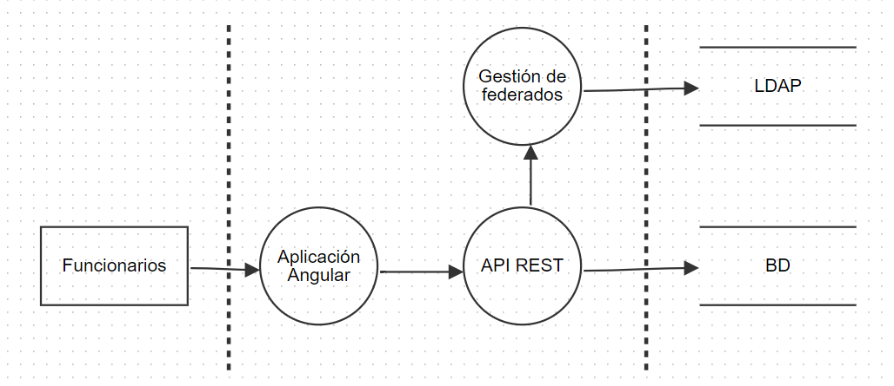
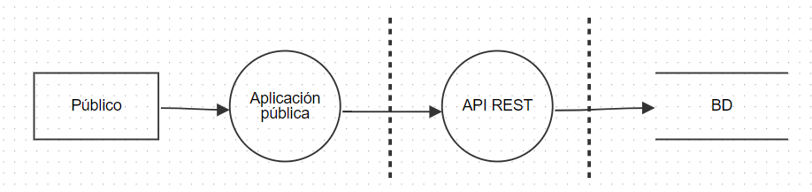

# Practico 5
# Índice

- [Funciones seleccionadas](#Introducción:)
- [Funciones seleccionadas](#Funciones-Seleccionadas:)
- [DFD Alto nivel](#Diagrama-de-flujo-de-datos-de-alto-nivel:)
- [DFD Segundo nivel por función](#Diagrama-de-flujo-de-datos-de-segundo-nivel-por-función:)
- [DFD Crear torneos](#Crear-torneos)
- [DFD Asignar jueces](#Asignar-jueces)
- [DFD Inscribir participantes](#Inscribir-participantes)
- [DFD Registrar puntajes](#Registrar-puntajes)
- [DFD Mostrar ranking](#Mostrar-ranking)

## Introducción:

## Funciones seleccionadas:

* Crear torneos
* Asignar jueces
* Inscribir participantes
* Registrar puntajes
* Mostrar ranking

## Diagrama de flujo de datos de alto nivel:

## Diagrama de flujo de datos de segundo nivel por función:

* ### Crear torneos

* ### Asignar jueces

* ### Inscribir participantes

* ### Registrar puntajes

* ### Mostrar ranking

## Amenzas por función.

### Crear torneos - Elevation of Privilege.

Un atacante podría modificar sus privilegios para crear torneos.

**Damage (9):** Un atacante podría crear torneos no autorizados y afectar la información mostrada al público.

**Reproducibility (8):** Si se encuentran vulnerabilidades de escalamiento de privilegios, este ataque podría repetirse fácilmente.

**Exploitability (6):** Se requiere encontrar una vulnerabilidad de escalamiento, lo que podría no ser tan complejo si no se han implementado buenas prácticas de seguridad.

**Affected users (6):** Los participantes del torneo se verían afectados.

**Discoverability (4):** Este ataque podría no ser inmediatamente evidente, especialmente si los torneos son creados de forma encubierta.

**Riesgo total:** 33/5 = 6,6

**Mitigación:** Verificar los controles de acceso en el servidor, no solo en el cliente. Esto evita que los usuarios intenten obtener accesos adicionales manipulando el lado del cliente.

### Registrar puntajes - Tampering.

Un atacante podría alterar los puntajes enviados por la aplicación.

**Damage (8):** El impacto de puntajes alterados es grave, ya que puede afectar directamente el resultado del torneo y la credibilidad del sistema.

**Reproducibility (7):** Una vez comprometido el sistema, un atacante podría alterar múltiples puntajes con relativa facilidad.

**Exploitability (5):** El ataque es factible si la transmisión de datos o la base de datos no están adecuadamente protegidas.

**Affected users (8):** Todos los participantes y organizadores del torneo se verían afectados, ya que el resultado del torneo se distorsionaría.

**Discoverability (4):** A menos que se revisen manualmente los puntajes, podría ser difícil detectar que han sido manipulados.

**Riesgo total:** 32/5 = 6,4

**Mitigación:** Asegurar que la aplicación Android utilice cifrado completo de las comunicaciones con la API para evitar la interceptación de puntajes.

### Registrar puntajes - Repudiation.

Un juez podría negar que asignó un puntaje a un participante.

**Damage (8):** Esto puede afectar la integridad de los resultados del torneo, cambiando el puntaje total y el ganador.

**Reproducibility (8):** Sin medidas de autenticación adecuadas, cualquier juez podría asignar un puntaje y luego negar haberlo hecho.

**Exploitability (6):** Si no se cuenta con registros detallados sobre quién realizó cada acción, un atacante podría explotar la vulnerabilidad sin requerir mucho conocimiento técnico.

**Affected users (7):** Se ven adectados los participantes y el público del torneo.

**Discoverability (5):** Puede ser detectada por jueces o por otros actores. Sin embargo, si no se cuentan con registros de auditoría, la falta de rastreabilidad no es evidente.

**Riesgo total:** 34/5 = 6,8

**Mitigación:** Autenticación de jueces utilizando certificados digitales o biometría para garantizar que solo jueces autorizados puedan registrar puntajes.

### Asignar jueces - Spoofing.

Un atacante podría suplantar la identidad de un funcionario autorizado y asignar jueces a un torneo sin autorización

**Damage (8):** La asignación de jueces no autorizados puede afectar la legitimidad y credibilidad del torneo.

**Reproducibility (7):** Una vez que el atacante consigue los datos de autenticación del funcionario, podría realizar este ataque repetidamente.

**Exploitability (5):** Este ataque es posible si no se implementan controles de autenticación robustos.

**Affected users (6):** Los organizadores y participantes se verían afectados, ya que el torneo podría ser manipulado.

**Discoverability (4):** Podría pasar desapercibido si no se revisan los registros de asignación.

**Riesgo total:** 30/5 = 6,0

**Mitigación:** Implementar autenticación de dos factores para los funcionarios y registros de auditoría detallados para todas las asignaciones de jueces. 

### Inscribir participantes - Tampering.

Un atacante podría manipular los datos de los participantes, inscribiendo a personas que no cumplen con los requisitos para competir.

**Damage (7):** Los participantes no autorizados pueden afectar la competitividad del torneo y su legitimidad.

**Reproducibility (6):** Si existe una vulnerabilidad en el sistema, el ataque puede repetirse fácilmente

**Exploitability (6):** El ataque es factible si los datos de los participantes no están protegidos adecuadamente.

**Affected users (7):**Todos los participantes y organizadores del torneo se ven afectados.

**Discoverability (5):**  Puede ser difícil detectar manipulación si no se realizan revisiones de los datos.

**Riesgo total:** 31/5 = 6,2

**Mitigación:**Asegurar que la API REST valide y registre todas las inscripciones y verificar los datos de los participantes en el sistema de Gestión de Federados.

### Mostrar ranking - Information Disclosure.

Un atacante podría obtener acceso no autorizado a los datos del ranking, exponiendo la información de puntajes antes de su publicación oficial.

**Damage (6):** La divulgación no autorizada de puntajes podría afectar la transparencia y confianza en el sistema.

**Reproducibility (7):** Una vez que el atacante obtiene acceso, puede repetir el ataque.

**Exploitability (5):** El ataque es posible si no se controlan adecuadamente los permisos de acceso a los datos del ranking.

**Affected users (5):** Participantes y el público se ven afectados, ya que la información filtrada puede manipular la percepción del torneo.

**Discoverability (5):** La exposición puede ser difícil de detectar si no se realizan auditorías en los accesos al ranking.

**Riesgo total:** 27/5 = 5,4

**Mitigación:** Restringir el acceso a los datos del ranking a usuarios autorizados y utilizar cifrado en las comunicaciones y el almacenamiento de datos sensibles. 

